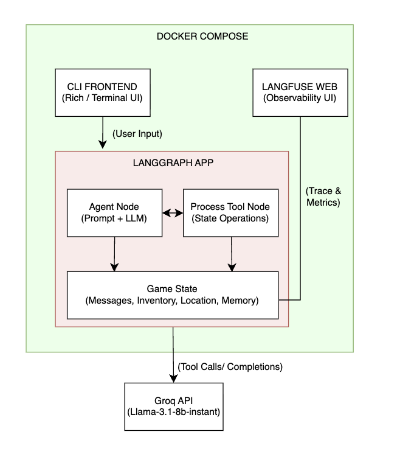

# AI-Dungeon-Master
An interactive, LLM-powered text adventure game built with LangGraph, Groq, and Langfuse.

## 1. Architecture

The system is fully containerized using Docker and follows an Agentic workflow managed by a cyclic state graph.



## 2. Design Decisions

**LangGraph for State Management:** Instead of using a standard sequential LangChain pipeline, LangGraph was chosen to create a cyclic agent. This allows the LLM to autonomously decide when to speak to the player and when to trigger internal game tools.

**Deterministic Tool Calling:** 
Critical game states (like inventory, current_location, and memory_flags) are explicitly decoupled from the LLM's conversational memory. The LLM must invoke specific tools (update_inventory, change_location) to modify the game world. This prevents the LLM from "hallucinating" items the player doesn't have.

**Dual Logging Strategy:** The application implements a clear separation of concerns for logging:
* **System Logs (`debug.log`):** Captures local system events, application state changes, and terminal errors.
* **AI Logs (Langfuse):** Integrated via callbacks at the Graph level, it provides real-time tracing of the LLM's reasoning, prompt executions, token monitoring, and tool-calling behaviors without cluttering the terminal.

## 3. Assumptions

**Single-Player Session:** The game currently assumes one active player per runtime (thread_id: "player_1").

**Environment Configuration:** It assumes the host machine has .env configured properly with a valid GROQ_API_KEY and Langfuse credentials.

**Sequential Interaction:** The application expects synchronous turn-based interaction (Player types -> AI processes -> AI responds).

## 4. Trade-offs
**Context Window vs. Cost (The Memory Problem):**

Trade-off: I'm currently appending all historical messages to the State. This provides maximum story coherence. However, as the conversation grows, the token count per request increases linearly, which can lead to hitting Groq's Rate Limits (429 errors) and increased latency.

## 5. What I would improve if I had another day

**1. Persistent Database for Checkpointer:** Replace the in-memory MemorySaver() with a robust database (like PostgreSQL or SQLite/SqliteSaver). This would allow players to completely shut down the Docker container and resume their exact game state days later.

**2. Context Summarization / RAG:** To solve the growing context window problem, I would implement an automatic summarization node. Once the message history exceeds a certain token threshold, an LLM would summarize older events and store them in a Vector Database (like Chroma or Pinecone) for retrieval (RAG), keeping the active prompt lightweight.

**3. Multi-threading / Multi-player Support:** Refactor the CLI loop and thread_id generation to allow multiple users to connect to the LangGraph backend simultaneously via an API (e.g., FastAPI).

## 6. Run APP
**Set up Environment Variables:**

Create a .env file in the root directory of your project and add your Groq API key (I sent you in email):

```bash
GROQ_API_KEY="gsk_your_api_key_here..."
```

You can run this application in two ways: using **Docker** (Recommended, includes the Langfuse observability dashboard) or **Locally** (via pure Python).

### Method 1: Running with Docker (Recommended)
This method automatically sets up the Langfuse server for tracing and runs the game in an isolated container.

**1. Start the Langfuse Observability Server**

a. Git clone Langfuse first:

```bash
git clone https://github.com/langfuse/langfuse.git
```

b. Run the following command from the project's root directory to spin up Langfuse and its database in the background:
```bash
docker compose up -d
```

**2. Access the Langfuse Dashboard**

Open your browser and navigate to: http://localhost:3000

Log in using the default credentials configured in your docker-compose.yml or .env file.

Open the Dungeon Master project and go to the Tracing tab.

**3. Play the Game (Interactive CLI)**

To start the text adventure, you need to run a temporary container that supports interactive terminal input:

```bash
docker compose run --rm dungeon-game
```

**4. Run Automated Tests**

To run the "Needle in a Haystack" memory test and see the traces appear on Langfuse, use:

```bash
docker compose run --rm dungeon-game python -m pytest tests/ -v -s
```

### Method 2: Running Locally (Without Docker, no Langfuse)

**1. Set up Environment Variables:**

```bash
export GROQ_API_KEY="gsk_your_api_key_here..."
```

**2. Play the Game:**

```bash
python src/main.py
```

**3. Run Automated Tests:**

```bash
python -m pytest tests/ -v -s
```